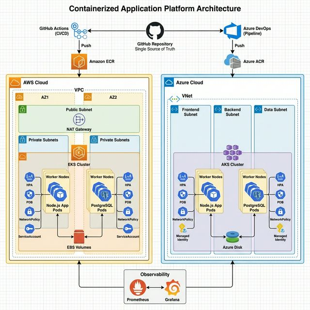

# Terraform Infrastructure

This directory contains Infrastructure as Code (IaC) definitions for provisioning the Capstone Project environment on AWS and Azure.

## Architecture

## Resources

### AWS Infrastructure (`aws/`)
-   **VPC**: Custom network with public/private subnets across multiple AZs.
-   **EKS Cluster**: Managed Kubernetes control plane.
-   **ECR Repository**: Central artifact registry for container images.

### Azure Infrastructure (`azure/`)
-   **Resource Group**: `capstone-rg` container.
-   **AKS Cluster**: Fully managed Kubernetes service.
-   **VNet**: Virtual Network with dedicated subnets.

## Prerequisites
*   [Terraform](https://www.terraform.io/downloads) installed (v1.0+)
*   Cloud Provider CLI configured (`aws` or `az`)

## Deployment

### AWS Deployment
1.  `cd aws`
2.  `terraform init`
3.  `terraform apply`

### Azure Deployment
1.  `cd azure`
2.  `terraform init`
3.  `terraform apply`
